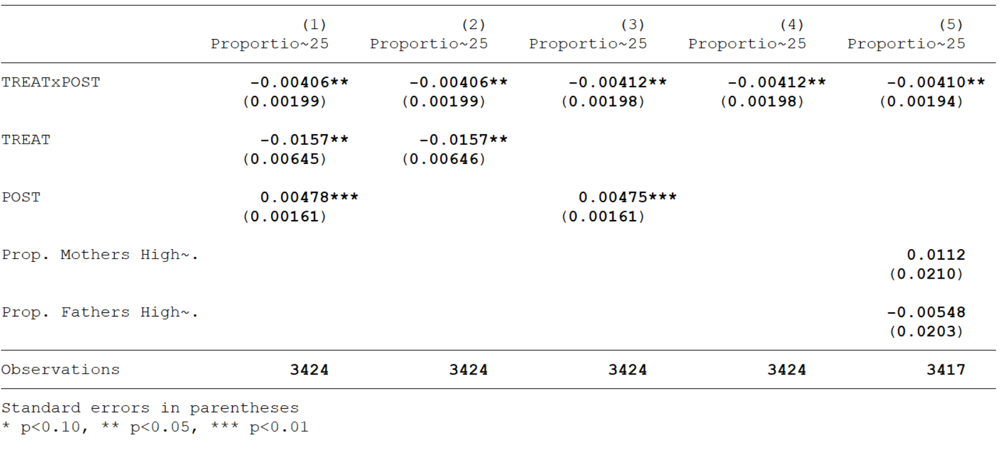
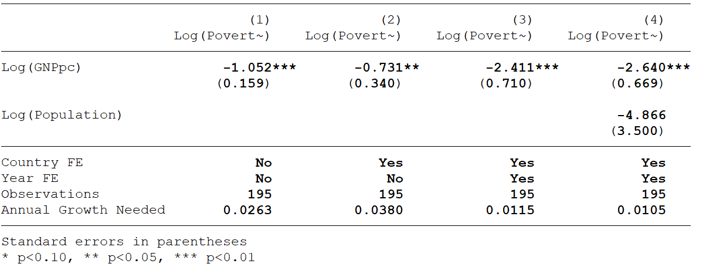
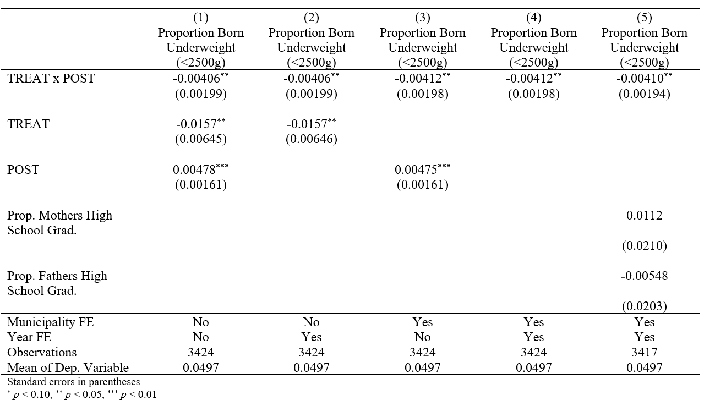

# Estimate Tables
Being able to present regression results in a clean, concise way is a skill almost as important as running the regressions themselves. You will never see a screenshot of STATA in a journal or when an author presents their work. Yet, there isn't a class that will formally teach you how to create publication quality tables. This guide is meant to be a _very_ brief introduction to producing exportable regression tables using STATA. 

_Nota Bene:  This will in no way, shape or form affect your grade, but it is best practice, and will be extremely useful if you go on to do graduate economics. If that is your plan, learning how to make estimate tables is definitely worth the time investment. There are similar workflows for R, but I will stick to STATA since it is most common._

# `eststo`/`esttab`/`estout`
The most common, and in my experience most effective, workflow for creating publication quality tables is using the `eststo`, `esttab`, and `estout` commands. There is a similar workflow that uses the `outreg` command, but I find it a little more cumbersome and a little less flexible. 

The basic idea of the `eststo`/`esttab`/`estout` workflow is that you "store" estimates from regression results using the `eststo` command, and then combine the estimates you have stored into a single table, where each column has the results of one regression model, using the `esttab` command. This table can easily then be exported from STATA to Word, Excel, or LateX.


I will cover the very basics to get you going, but the documentation is available [here.](http://repec.sowi.unibe.ch/stata/estout/) There are tons of things you can do with these commands, and the documentation is fantastic.

For demonstration purposes, I will be estimating a Differences-in-Differences model that aims to measure the effects of the Familias en Accion Condition Cash Transfer Program on neo-natal health. The Health Economics literature suggests that birth weight is a strong predictor of human capital later on in life. As such, policies that improve _in-utero_ health can be very useful (and often cost effective) development programs. You can [download the data here](Sample_data_FeA.dta) to play with and follow along.

## Installation

To get started, install the necessary packages by running the command:
```
ssc install estout
```
And you're good to go!

## Storing Estimates
To store estimates, we use the `eststo` command. Let's use  as an example. There are two ways to store the estimates using `eststo`:

```
reghdfe lbw did treat [aweight = weight], absorb(year) vce(cluster codmpio)
eststo did_yfe
```
or (my prefered syntax):
```
eststo did_yfe: reghdfe lbw did treat [aweight = weight], absorb(year) vce(cluster codmpio)
```
Once you have run this, the results will be stored under the name _did_yfe_ that you can call upon when you create the estimate table.  There is more you can do with the command, but this is all you will be doing 90% of the time. Note that naming is technically optional, and you can choose to leave it out - don't do that, future you will hate you.

## Creating an Estimate Table
Say you have run a number of different models and haves stored them. You can now create an estimate table! To do this, we use the `esttab` command. For this example, I have estimated a series of models where I vary the fixed effects and controls used. They are saved under the names _did, did_yfe, did_mfe, did_myfe,_ and _did_myfe_control_. To create an estimate table, you can run the command:
```
esttab did did_yfe did_mfe did_myfe did_myfe_control
```
This will produce a rather crude table, with t-stats instead of standard errors and the "wrong" significance stars! We can easily fix all of that by adding some options to the command

- `se` will add standard errors in parenthesis
- `label` will use variable labels instead of names. Please use labels. No one wants to be guessing what _lnhct_1_pc_4rtk_ means....
- `keep` will let you specify what coefficients you want to report. In this case, we do not care about the constant, and will omit it. 
- `star(* 0.10 ** 0.05  *** 0.01)` will produce the usual star system that we use by (outdated, wrong) convention.

Adding these options will make your command look like this:
```
esttab did did_yfe did_mfe did_myfe did_myfe_control, label se star(* 0.10 ** 0.05 *** 0.01) keep(did treat post mat_hs_v pat_hs_v)
```
We now have a table that actually looks like something you might see in a paper! 


## `estadd` - a very useful addition!
Say there is some extra information about your model that you want to share in your table. In that case, `estadd` can be incredibly useful. For example, you may want to make it clear to your reader what fixed effects you are using in a specific regression. To do this, you can add a local macro to your stored estimate. This will look something like this:

```
eststo did_mfe: reghdfe lbw did post [aweight = weight], absorb(codmpio) vce(cluster codmpio)
quietly estadd local fixedm "Yes", replace
quietly estadd local fixedy "No", replace
```
What we have done here is created a local macro named _fixedm_ that takes value "Yes" for this regression because we are using municipality fixed effects, and similarly _fixedy_ for year fixed effects which takes value "No". We will include these macros in the table as rows later using esttab. Note that I include `replace` as an option - this is to tell STATA to overwrite anything that is already written in that spot. 

In addition to indicating fixed effects, we can use `estadd` to add calculated statistics. This will often be the mean of the dependent variable, as we will do for these results. Reporting the mean of the dependent variable in a table helps the reader understand the magnitude of a calculated effect. To do this, the command `estadd ysumm` tells stata to store the summary statistics of the outcome variable, to be called upon later.

```
eststo did_mfe: reghdfe lbw did post [aweight = weight], absorb(codmpio) vce(cluster codmpio)
quietly estadd local fixedm "Yes", replace
quietly estadd local fixedy "No", replace 
estadd ysumm, replace
```

We can also use `estadd` to add statistics that are calculated from estimate results (usually some transformation of $\beta$ coefficients).

Once we have run these, we can create a table that includes this additional information. To do this, we use the `scalars` option. We need to list the scalar/locals that we want, and give the rows names using the `label` suboption. There are some scalars that are automatically stored. For example, `N` will give you number of observations. `ymean` will call upon the mean of the dependent variable, that we had stored using `ysumm`. The command will look like this:

```
esttab did did_yfe did_mfe did_myfe did_myfe_control using "sample_reg_table.rtf", replace label se star(* 0.10 ** 0.05 *** 0.01)s(fixedm fixedy N ymean,label("Municipality FE" "Year FE" "Observations" "Mean of Dep. Variable")) keep(did treat post mat_hs_v pat_hs_v);
```
**Bonus Tip!!!** This is an unreadably long line... what we can do is change the delimiter to a semicolon. The `#delimit ;` command tells STATA that from that point forward, a line is not over until it has seen a semicolon. When we are done with our absurdly long command, we can make the delimiter a carriage return (what old people call enter because of typewriters) again using the `#delimit cr` command. Much better:

```
#delimit ;
esttab did did_yfe did_mfe did_myfe did_myfe_control using "sample_reg_table.rtf", 
	replace label se star(* 0.10 ** 0.05 *** 0.01)
	s(fixedm fixedy N ymean,
	label("Municipality FE" "Year FE" "Observations" "Mean of Dep. Variable"))
	keep(did treat post mat_hs_v pat_hs_v);
#delimit cr
```
This produces the exact table that we want to be showing people. Looks good, huh?



##  Exporting to Word
The real beauty of `esttab` is that it makes it easy to export the table to your favourite typesetter. If you want to use the table in Word, simply add `using filename.rtf` to your command. If you specify just a filename, the rtf document will be placed in your current directory. Alternatively, you can use a full file path to specify where you want the table saved. The code should look like this:

```
#delimit ;
esttab did did_yfe did_mfe did_myfe did_myfe_control using "sample_reg_table.rtf", 
	replace label se star(* 0.10 ** 0.05 *** 0.01)
	s(fixedm fixedy N ymean,
	label("Municipality FE" "Year FE" "Observations" "Mean of Dep. Variable"))
	keep(did treat post mat_hs_v pat_hs_v);
#delimit cr
```
Note that I include the `replace` option. This is so that STATA will overwrite any existing file of that name (otherwise it will yell at you if you run your code more than once). You can also export to Excel, I find that .csv works better than .xls, but to each their own. The table will open up in Word like this:




## Exporting to LaTeX
`esttab`  can also make LaTeX tables for you! Run the following code and it will create a .tex file that contains the table. You can either copy-paste this into your source code - or better yet, reference it in the code using the `\include()` command. If you do that, every time you update your results and STATA replaces the output table, the results in your paper update automatically. In my opinion, this is the ideal workflow. 

 ```
#delimit ;
esttab did did_yfe did_mfe did_myfe did_myfe_control using "sample_reg_table.tex", 
	replace label se star(* 0.10 ** 0.05 *** 0.01)
	s(fixedm fixedy N ymean,
	label("Municipality FE" "Year FE" "Observations" "Mean of Dep. Variable"))
	keep(did treat post mat_hs_v pat_hs_v);
#delimit cr
```
The output file that this command produces will look like this - much easier than manually creating a table in LaTeX. You can also create _booktabs_ tables (simply add the `booktabs` option in the `esttab` command and make sure you are loading the correct packages in your .tex file). _Booktabs_ tables look much nicer than the .tex default.

```
{
\def\sym#1{\ifmmode^{#1}\else\(^{#1}\)\fi}
\begin{tabular}{l*{5}{c}}
\hline\hline
                    &\multicolumn{1}{c}{(1)}&\multicolumn{1}{c}{(2)}&\multicolumn{1}{c}{(3)}&\multicolumn{1}{c}{(4)}&\multicolumn{1}{c}{(5)}\\
                    &\multicolumn{1}{c}{Proportion Born Underweight (<2500g)}&\multicolumn{1}{c}{Proportion Born Underweight (<2500g)}&\multicolumn{1}{c}{Proportion Born Underweight (<2500g)}&\multicolumn{1}{c}{Proportion Born Underweight (<2500g)}&\multicolumn{1}{c}{Proportion Born Underweight (<2500g)}\\
\hline
TREAT x POST        &    -0.00406\sym{**} &    -0.00406\sym{**} &    -0.00412\sym{**} &    -0.00412\sym{**} &    -0.00410\sym{**} \\
                    &   (0.00199)         &   (0.00199)         &   (0.00198)         &   (0.00198)         &   (0.00194)         \\
[1em]
TREAT               &     -0.0157\sym{**} &     -0.0157\sym{**} &                     &                     &                     \\
                    &   (0.00645)         &   (0.00646)         &                     &                     &                     \\
[1em]
POST                &     0.00478\sym{***}&                     &     0.00475\sym{***}&                     &                     \\
                    &   (0.00161)         &                     &   (0.00161)         &                     &                     \\
[1em]
Prop. Mothers High School Grad.&                     &                     &                     &                     &      0.0112         \\
                    &                     &                     &                     &                     &    (0.0210)         \\
[1em]
Prop. Fathers High School Grad.&                     &                     &                     &                     &    -0.00548         \\
                    &                     &                     &                     &                     &    (0.0203)         \\
\hline
Municipality FE     &          No         &          No         &         Yes         &         Yes         &         Yes         \\
Year FE             &          No         &         Yes         &          No         &         Yes         &         Yes         \\
Observations        &        3424         &        3424         &        3424         &        3424         &        3417         \\
Mean of Dep. Variable&      0.0497         &      0.0497         &      0.0497         &      0.0497         &      0.0497         \\
\hline\hline
\multicolumn{6}{l}{\footnotesize Standard errors in parentheses}\\
\multicolumn{6}{l}{\footnotesize \sym{*} \(p<0.10\), \sym{**} \(p<0.05\), \sym{***} \(p<0.01\)}\\
\end{tabular}
}

```

# Sample Code
```
****************************************************
*         USING ESTTAB FOR REGRESSION TABLES       *
*                 AUTHOR: DARIO TOMAN              *
*               	Sample Code                *
*                                                  *
****************************************************

* This code is meant as an aid - there are n+1 ways to do things in STATA

clear all
set more off
cd "G:\----- REDACTED! ------\Eco403_bobonis\example_esttab"

*Begin by loading data
use "Sample_data_FeA.dta"

*Generate variables that are needed for Differences-in-Differences Analysis
gen treat = (FeA_year_reg==2001)
gen post = (year > 2000)
gen did = treat*post

label variable did "TREAT x POST"
label variable treat "TREAT"
label variable post "POST"

****************************************************
*                    Regressions       	           *
****************************************************
eststo did: reghdfe lbw did treat post[aweight = weight], noabsorb vce(cluster codmpio)
estadd local fixedm "No", replace
estadd local fixedy "No", replace
estadd ysumm, replace
eststo did_yfe: reghdfe lbw did treat [aweight = weight], absorb(year) vce(cluster codmpio)
quietly estadd local fixedm "No", replace
quietly estadd local fixedy "Yes", replace
estadd ysumm, replace
eststo did_mfe: reghdfe lbw did post [aweight = weight], absorb(codmpio) vce(cluster codmpio)
quietly estadd local fixedm "Yes", replace
quietly estadd local fixedy "No", replace
estadd ysumm, replace
eststo did_myfe: reghdfe lbw did [aweight = weight], absorb(codmpio year) vce(cluster codmpio)
quietly estadd local fixedm "Yes", replace
quietly estadd local fixedy "Yes", replace
estadd ysumm, replace
eststo did_myfe_control: reghdfe lbw did mat_hs_v pat_hs_v [aweight = weight], absorb(codmpio year) vce(cluster codmpio)
quietly estadd local fixedm "Yes", replace
quietly estadd local fixedy "Yes", replace
estadd ysumm, replace


esttab, label


****************************************************
*                       TABLE         	           *
****************************************************

*I can now use the esttab function to generate one table that will have all of
*the results. 

#delimit ;
esttab did did_yfe did_mfe did_myfe did_myfe_control, label se star(* 0.10 ** 0.05 *** 0.01)
	s(fixedm fixedy N ymean,
	label("Municipality FE" "Year FE" "Observations" "Mean of Dep. Variable"))
	keep(did treat post mat_hs_v pat_hs_v);
#delimit cr


* I can export this table to an .rtf file that can be pasted into word 

#delimit ;
esttab did did_yfe did_mfe did_myfe did_myfe_control using "sample_reg_table.rtf", 
	replace label se star(* 0.10 ** 0.05 *** 0.01)
	s(fixedm fixedy N ymean,
	label("Municipality FE" "Year FE" "Observations" "Mean of Dep. Variable"))
	keep(did treat post mat_hs_v pat_hs_v);
#delimit cr


* Or LateX if I'm feeling ~*~fancy ~*~

#delimit ;
esttab did did_yfe did_mfe did_myfe did_myfe_control using "sample_reg_table.tex", 
	replace label se star(* 0.10 ** 0.05 *** 0.01)
	s(fixedm fixedy N ymean,
	label("Municipality FE" "Year FE" "Observations" "Mean of Dep. Variable"))
	keep(did treat post mat_hs_v pat_hs_v);
#delimit cr


```
