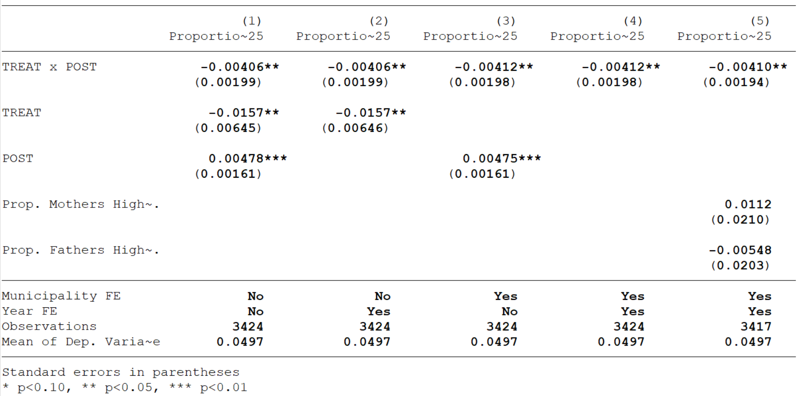

# Estimate Tables
Being able to present regression results in a clean, concise way is a skill almost as important as running the regressions themselves. You will never see a screenshot of STATA in a journal or when an author presents their work. Yet, there isn't a class that will formally teach you how to create publication quality tables. This guide is meant to be a _very_ brief introduction to producing exportable regression tables using STATA. 

_Nota Bene:  This will in no way, shape or form affect your grade, but it is best practice, and will be extremely useful if you go on to do graduate economics. If that is your plan, learning how to make estimate tables is definitely worth the time investment. There are similar workflows for R, but I will stick to STATA since it is most common._

# `eststo`/`esttab`/`estout`

The most common, and in my experience most effective, workflow for creating publication quality tables is using the `eststo`, `esttab`, and `estout` commands. There is a similar workflow that uses the `outreg` command, but I find it a little more cumbersome and a little less flexible. 

The basic idea of the `eststo`/`esttab`/`estout` workflow is that you "store" estimates from regression results using the `eststo` command, and then combine the estimates you have stored into a single table, where each column has the results of one regression model, using the `esttab` command. This table can easily then be exported from STATA to Word, Excel, or LateX.


I will cover the very basics to get you going, but the documentation is available [here.](http://repec.sowi.unibe.ch/stata/estout/) There are tons of things you can do with these commands, and the documentation is fantastic.

## Installation

To get started, install the necessary packages by running the command:
```
ssc install estout
```
And you're good to go!

## Storing Estimates
To store estimates, we use the `eststo` command. Let's use the regression from part (b) as an example. There are two ways to store the estimates using `eststo`:

```
areg ln_hcount ln_gnppc if povline<50, absorb(ccode) cluster(ccode)
eststo part_b
```
or (my prefered syntax):
```
eststo part_b: areg ln_hcount ln_gnppc if povline<50, absorb(ccode) cluster(ccode)
```
Once you have run this, the results will be stored under the name _part_b_ that you can call upon when you create the estimate table.  There is more you can do with the command, but this is all you will be doing 90% of the time. Note that naming is technically optional, and you can choose to leave it out - don't do that, future you will hate you.

## Creating an Estimate Table
Say you've run all the models for this assignment, and have logically named them _part_a_, _part_b_, _part_c1_, and _part_c2_. You can now create an estimate table! To do this, we use the `esttab` command:
```
esttab part_a part_b part_c1 part_c2
```
This will produce a very ugly table, with too many dummy variables, t-stats instead of standard errors, and the wrong significance stars! We can easily fix all of that by adding some options to the command

- `se` will add standard errors in parenthesis
- `label` will use variable labels instead of names. Please use labels. No one wants to be guessing what _lnhct_1_pc_4rtk_ means....
- `keep` will let you specify what coefficients you want to report. In our case, we only really care about Log(GNPpc) and Log(Population)
- `star(* 0.10 ** 0.05  *** 0.01)` will produce the usual star system that we use by (outdated, wrong) convention

Adding these options will make your command look like this:
```
esttab part_a part_b part_c1 part_c2, label se star(* 0.10 ** 0.05 *** 0.01) keep(ln_gnppc ln_pop)
```
We now have a table that actually looks like something you might see in a paper! 

## `estadd` - a very useful addition!
Say there is some extra information about your model that you want to share in your table. In that case, `estadd` can be incredibly useful. Let's continue with the example regression from part (b).  You would likely want to make it clear to your reader that in this regression, you are using country fixed effects, but not year fixed effects. To do this, you can add a local macro to your stored estimate. This will look something like this:

```
eststo part_b: areg ln_hcount ln_gnppc if povline<50, absorb(ccode) cluster(ccode)
estadd local fixed_country "Yes", replace
estadd local fixed_year "No", replace
```
What we have done here is created a local macro named _fixed_country_ that takes value "Yes" for this regression, and similarly _fixed_year_ which takes value "No". We will include these macros in the table as rows later on using esttab. Note that I include `replace` as an option - this is to tell STATA to overwrite anything that is already written in that spot. 

In addition to indicating fixed effects, we can use `estadd` to add calculated statistics. This will often be the mean of the dependent variable, but in our case, the required growth rate calculation for part (e) fits here perfectly:

```
eststo part_b: areg ln_hcount ln_gnppc if povline<50, absorb(ccode) cluster(ccode)
estadd local fixed_country "Yes", replace
estadd local fixed_year "No", replace
estadd scalar growth= log(0.5)/(_b[ln_gnppc]*25)
```
where `b[ln_gnnpc]` tells STATA to use the $\beta$ coefficient for _ln_gnnpc_ from the estimate in the calculation. Note that this is a scalar that we are adding, and not a local. 

Once we have run these, we can create a table that includes this additional information. To do this, we use the `scalars` option. We need to list the scalar/locals that we want, and give the rows names using the `label` suboption. There are some scalars that are automatically stored. For example, `N` will give you number of observations. The command will look like this:

```
esttab part_a part_b part_c1 part_c2, label se star(* 0.10 ** 0.05 *** 0.01) scalars(fixed_country fixed_year N growth,label("Country FE" "Year FE" "Observations" "Annual Growth Needed" ))keep(ln_gnppc ln_pop)
```
**Bonus Tip!!!** This is an unreadably long line... what we can do is change the delimiter to a semicolon. The `#delimit ;` command tells STATA that from that point forward, a line is not over until it has seen a semicolon. When we are done with our absurdly long command, we can make the delimiter a carriage return (what old people call enter because of typewriters) again using the `#delimit cr` command. Much better:

```
#delimit ;
esttab part_a part_b part_c1 part_c2, 
	label se star(* 0.10 ** 0.05 *** 0.01)
	scalars(fixed_country fixed_year N growth,
	label("Country FE" "Year FE" "Observations" "Annual Growth Needed" ))
	keep(ln_gnppc ln_pop);
#delimit cr
```
This produces the exact table that we want to be showing people. Looks good, huh?



##  Exporting to Word
The real beauty of `esttab` is that it makes it easy to export the table to your favourite typesetter. If you want to use the table in Word, simply add `using filename.rtf` to your command. If you specify just a filename, the rtf document will be placed in your current directory. Alternatively, you can use a full file path to specify where you want the table saved. The code should look like this:

```
#delimit ;
esttab part_a part_b part_c1 part_c2 using "assignment_1_table.rtf", 
	replace label se star(* 0.10 ** 0.05 *** 0.01)
	s(fixed_country fixed_year N growth,
	label("Country FE" "Year FE" "Observations" "Annual Growth Needed" ))
	keep(ln_gnppc ln_pop);
#delimit cr
```
Note that I include the `replace` option. This is so that STATA will overwrite any existing file of that name (otherwise it will yell at you if you run your code more than once). You can also export to Excel, I find that .csv works better than .xls, but to each their own. The table will open up in Word like this:


## Exporting to LaTeX
`esttab`  can also make LaTeX tables for you! Run the following code and it will create a .tex file that contains the table. You can either copy-paste this into your source code - or better yet, reference it in the code using the `\include()` command. If you do that, every time you update your results and STATA replaces the output table, the results in your paper update automatically. In my opinion, this is the ideal workflow. 

 ```
#delimit ;
esttab part_a part_b part_c1 part_c2 using "assignment_1_table.tex", 
	replace label se star(* 0.10 ** 0.05 *** 0.01)
	s(fixed_country fixed_year N growth,
	label("Country FE" "Year FE" "Observations" "Annual Growth Needed" ))
	keep(ln_gnppc ln_pop);
#delimit cr
```
The output file that this command produces will look like this - much easier than manually creating a table in LaTeX. You can also create _booktabs_ tables (simply add the `booktabs` option in the `esttab` command and make sure you are loading the correct packages in your .tex file. _Booktabs_ tables look much nicer than the .tex default.

```
{
\def\sym#1{\ifmmode^{#1}\else\(^{#1}\)\fi}
\begin{tabular}{l*{4}{c}}
\hline\hline
                    &\multicolumn{1}{c}{(1)}&\multicolumn{1}{c}{(2)}&\multicolumn{1}{c}{(3)}&\multicolumn{1}{c}{(4)}\\
                    &\multicolumn{1}{c}{Log(Poverty Head-Count)}&\multicolumn{1}{c}{Log(Poverty Head-Count)}&\multicolumn{1}{c}{Log(Poverty Head-Count)}&\multicolumn{1}{c}{Log(Poverty Head-Count)}\\
\hline
Log(GNPpc)          &      -1.052\sym{***}&      -0.731\sym{**} &      -2.411\sym{***}&      -2.640\sym{***}\\
                    &     (0.159)         &     (0.340)         &     (0.710)         &     (0.669)         \\
[1em]
Log(Population)     &                     &                     &                     &      -4.866         \\
                    &                     &                     &                     &     (3.500)         \\
\hline
Country FE          &          No         &         Yes         &         Yes         &         Yes         \\
Year FE             &          No         &          No         &         Yes         &         Yes         \\
Observations        &         195         &         195         &         195         &         195         \\
Annual Growth Needed&      0.0263         &      0.0380         &      0.0115         &      0.0105         \\
\hline\hline
\multicolumn{5}{l}{\footnotesize Standard errors in parentheses}\\
\multicolumn{5}{l}{\footnotesize \sym{*} \(p<0.10\), \sym{**} \(p<0.05\), \sym{***} \(p<0.01\)}\\
\end{tabular}
}

```

# Sample Code
```
****************************************************
*		ECO403 - Development		   *
*	    	Assignment 1			   *
*		Sample Code                        *
*                                                  *
****************************************************

* This code is meant as an aid - there are n+1 ways to do things in STATA

clear all
set more off
cd "G:\----- REDACTED! ------\eco403_bobonis\assignment_1"

use "PSET1.dta"


****************************************************
*     	 	        Part A	         	   *
****************************************************

*Generate log(poverty headcount) and log(GNPpc)

gen ln_hcount = log(hcount)
label variable ln_hcount "Log(Poverty Head-Count)"

gen ln_gnppc = log(gnppc)
label variable ln_gnppc "Log(GNPpc)"

* Part A regression

eststo part_a: reg ln_hcount ln_gnppc if povline<50, cluster(ccode)
estadd local fixed_country "No", replace
estadd local fixed_year "No", replace
estadd scalar growth= log(0.5)/(_b[ln_gnppc]*25)


****************************************************
*     	 	        Part B	         	   *
****************************************************

eststo part_b: areg ln_hcount ln_gnppc if povline<50, absorb(ccode) cluster(ccode)
estadd local fixed_country "Yes", replace
estadd local fixed_year "No", replace
estadd scalar growth= log(0.5)/(_b[ln_gnppc]*25)


* I am rather partial towards "reghdfe" as a command - you will see why later.
* It will give you the exact same coefficient estimates, but slightly different
* standard errors - turns out that "areg" does some things wrong with st. err
* calculations. In any case, this is the syntax for "reghdfe":

reghdfe ln_hcount ln_gnppc if povline<50, absorb(ccode) vce(cluster ccode)


****************************************************
*     	 	        Part C	         	   *
****************************************************

*Part C.1


eststo part_c1: areg ln_hcount ln_gnppc i.year if povline<50, absorb(ccode) cluster(ccode)
estadd local fixed_country "Yes", replace
estadd local fixed_year "Yes", replace
estadd scalar growth= log(0.5)/(_b[ln_gnppc]*25)


*you can use "areg" with factor notation to include year dummies, since areg 
*does not allow for more than one fixed effect. Alternatively, "reghdfe" allows 
*you to very easily include multiple fixed effects, which makes life a lot simpler:

reghdfe ln_hcount ln_gnppc if povline<50, absorb(ccode year) vce(cluster ccode)


*Part C.2

*Generate Log(Population)

gen ln_pop = log(pop)
label variable ln_pop "Log(Population)"

*Regression:

eststo part_c2: areg ln_hcount ln_gnppc ln_pop i.year if povline<50, absorb(ccode) cluster(ccode)
estadd local fixed_country "Yes", replace
estadd local fixed_year "Yes", replace
estadd scalar growth= log(0.5)/(_b[ln_gnppc]*25)


* Alternatively, using "reghdfe"
reghdfe ln_hcount ln_gnppc ln_pop if povline<50, absorb(ccode year) vce(cluster ccode)


****************************************************
*	         	TABLE           	   *
****************************************************

*I can now use the esttab function to generate one table that will have all of
*the results. 

#delimit ;
esttab part_a part_b part_c1 part_c2, label se star(* 0.10 ** 0.05 *** 0.01)
	s(fixed_country fixed_year N growth,
	label("Country FE" "Year FE" "Observations" "Annual Growth Needed" ))
	keep(ln_gnppc ln_pop);
#delimit cr


* I can export this table to an .rtf file that can be pasted into word 

#delimit ;
esttab part_a part_b part_c1 part_c2 using "assignment_1_table.rtf", 
	replace label se star(* 0.10 ** 0.05 *** 0.01)
	s(fixed_country fixed_year N growth,
	label("Country FE" "Year FE" "Observations" "Annual Growth Needed" ))
	keep(ln_gnppc ln_pop);
#delimit cr


* Or LateX if I'm feeling ~*~fancy ~*~

#delimit ;
esttab part_a part_b part_c1 part_c2 using "assignment_1_table.tex", 
	replace label se star(* 0.10 ** 0.05 *** 0.01)
	s(fixed_country fixed_year N growth,
	label("Country FE" "Year FE" "Observations" "Annual Growth Needed" ))
	keep(ln_gnppc ln_pop);
#delimit cr
```
